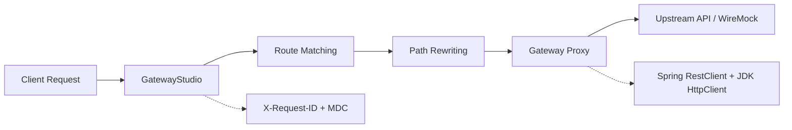

# GatewayStudio

> **The modern, high-throughput, self-service API Gateway platform built on Java 25 and Spring Cloud Gateway Server Web MVC.**

## What is GatewayStudio?

GatewayStudio is a next-generation, self-service API Gateway platform engineered to serve as a unified, high-performance entry point for backend microservices. Built on **Java 25** and **Spring Cloud Gateway Server Web MVC**, GatewayStudio simplifies API routing, path rewriting, upstream service integration, and gateway-level policy enforcement while providing a foundation for operational visibility and developer self-service management.

### Current Request Flow

### Key Capabilities Implemented

- **Routing & Path Rewriting**  
  Translates public-facing routes into internal upstream endpoints.

- **Embedded Upstream Mocking**  
  Integrates WireMock for local integration testing, upstream response simulation, delay simulation, and fault scenarios.

- **Request Correlation & Tracing**  
  A global request filter generates and propagates `X-Request-ID` while maintaining an MDC context for request correlation across gateway logs and downstream services.

- **Audit logging**  
  API request metadata logs are storing in JSON format, for further process and analytics.

## 🚀 Roadmap & What's Next

GatewayStudio is evolving from a core proxy engine into a full-featured API management platform.

- 🛠️ **Self-Service Route & Service Management**  
  Dynamic route and upstream service management through a self-service administrative interface.

- 🔐 **Authentication & Authorization**  
  Edge security capabilities including API authentication, OAuth2/JWT integration, and access controls.

- 🚦 **Traffic Shaping & Resilience Policies**  
  Rate limiting, request throttling, circuit breaking, retries, and other gateway-level policies.

- 💾 **Persistent Dynamic Configuration**  
  Database-backed configuration and controlled route publishing without requiring application restarts.

- 📊 **Analytics & Audit Logging**  
  Request analytics, audit trails, and enhanced operational visibility.

- ☁️ **Production-Grade Cloud Deployment**  
  Containerized deployment with support for scalable, cloud-native environments.
